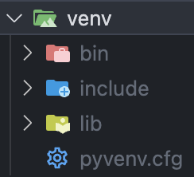
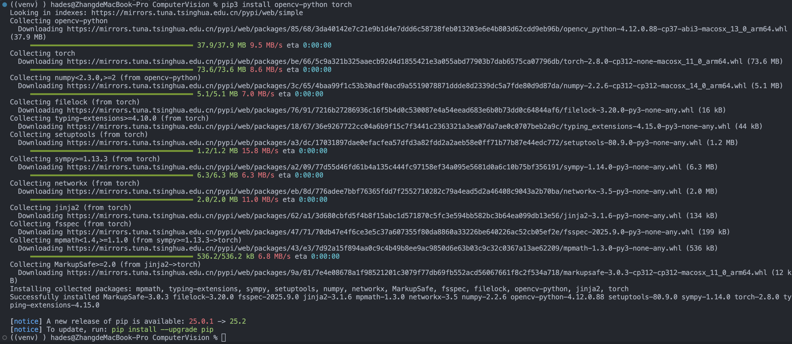

# 实验一：OpenCV与PyTorch框架安装与环境配置

## 一、实验目的

安装Opencv和PyTorch框架并配置其学习环境
要求：使用conda新建虚拟环境，安装OpenCV、PyTorch及相关依赖软件。

## 二、实验内容

首先用Python新建一个新的venv

```bash
python3 -m venv ./venv
```



可以看到我们成功新建了一个虚拟环境

使用venv文件夹下的脚本激活这个环境

```bash
source venv/bin/activate
```

```log
((venv) ) hades@ZhangdeMacBook-Pro ComputerVision %
```

然后使用PIP安装OpenCV和PyTorch

```bash
pip3 install opencv-python torch
```



到此为止 环境配置完成

## 三、实验总结

本次实验成功完成了OpenCV和PyTorch的安装配置。虽然实验要求用conda，但我实际使用了Python自带的venv创建虚拟环境，效果是一样的。整个过程很顺利：先用`python3 -m venv ./venv`创建了虚拟环境，然后用`source venv/bin/activate`激活它，最后用pip一次性装好了OpenCV和PyTorch。通过这次实验，我理解了虚拟环境的作用就是把不同项目的依赖隔离开，避免版本冲突，而且pip会自动处理依赖关系，安装起来很方便。现在环境已经搭建好了，可以开始后面的计算机视觉和深度学习实验了。
