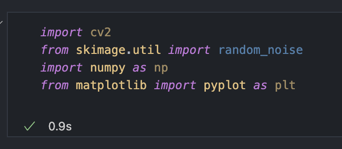
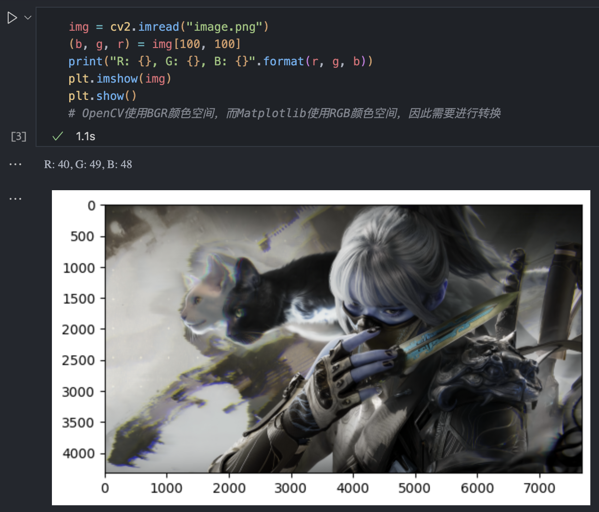
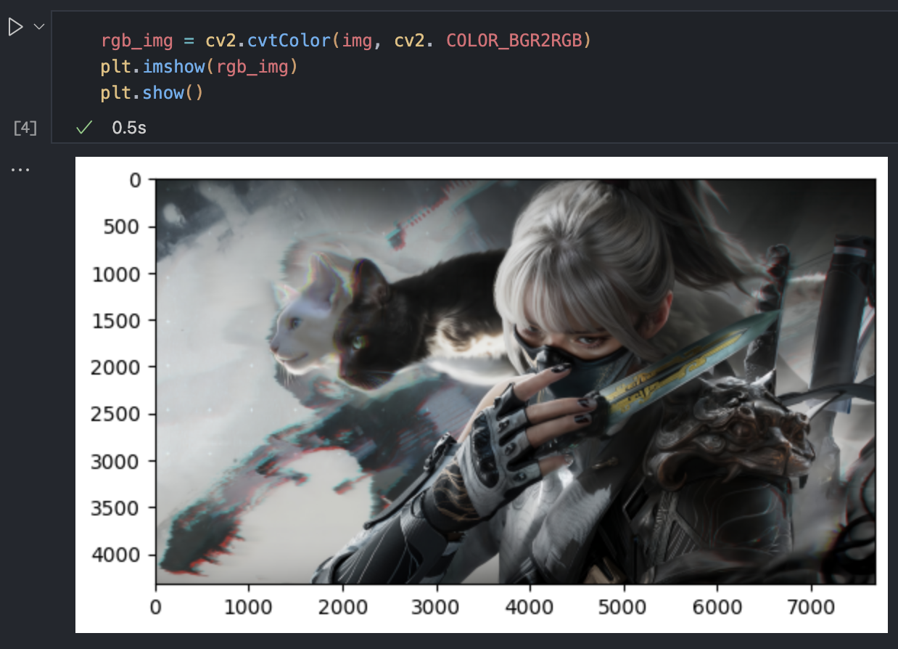
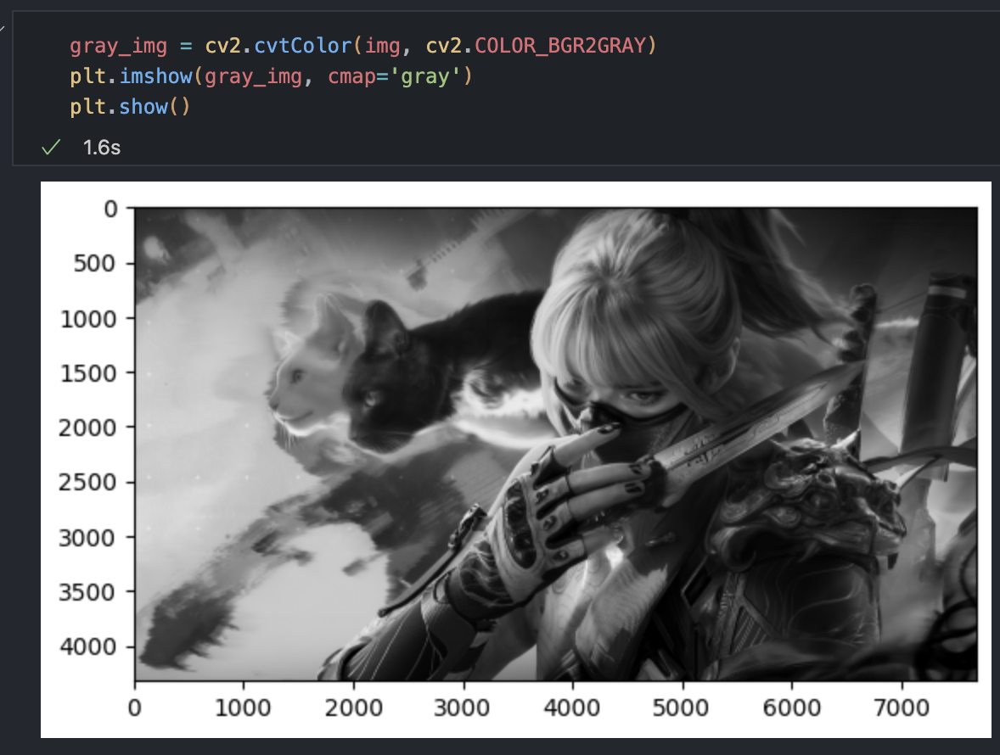
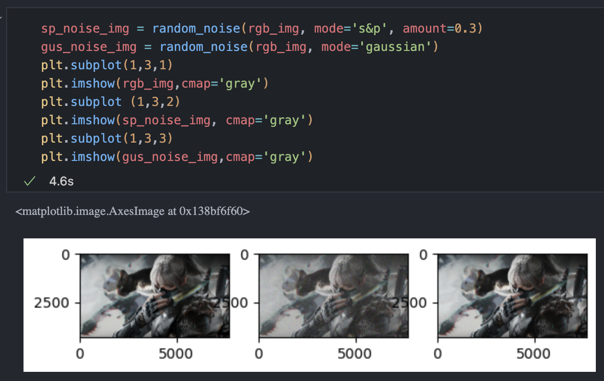
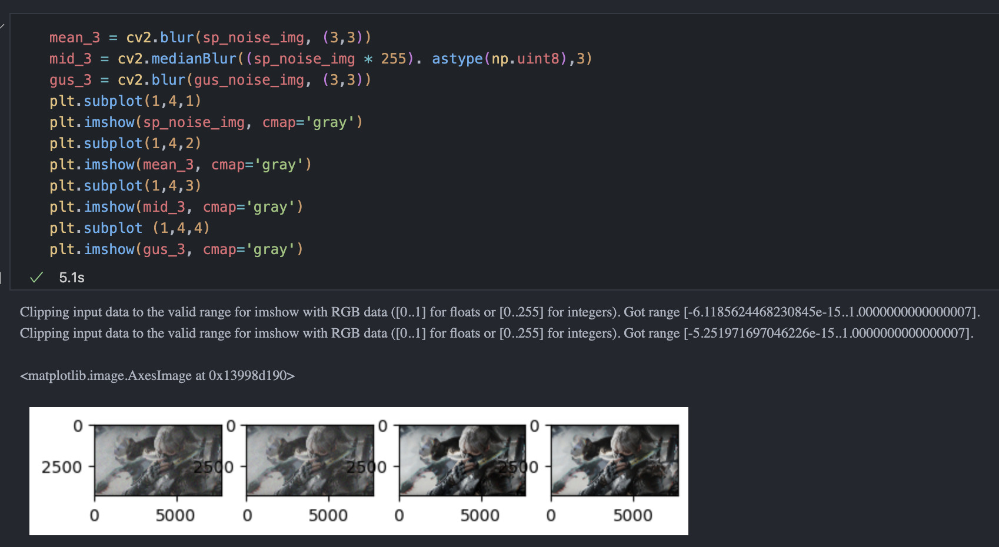
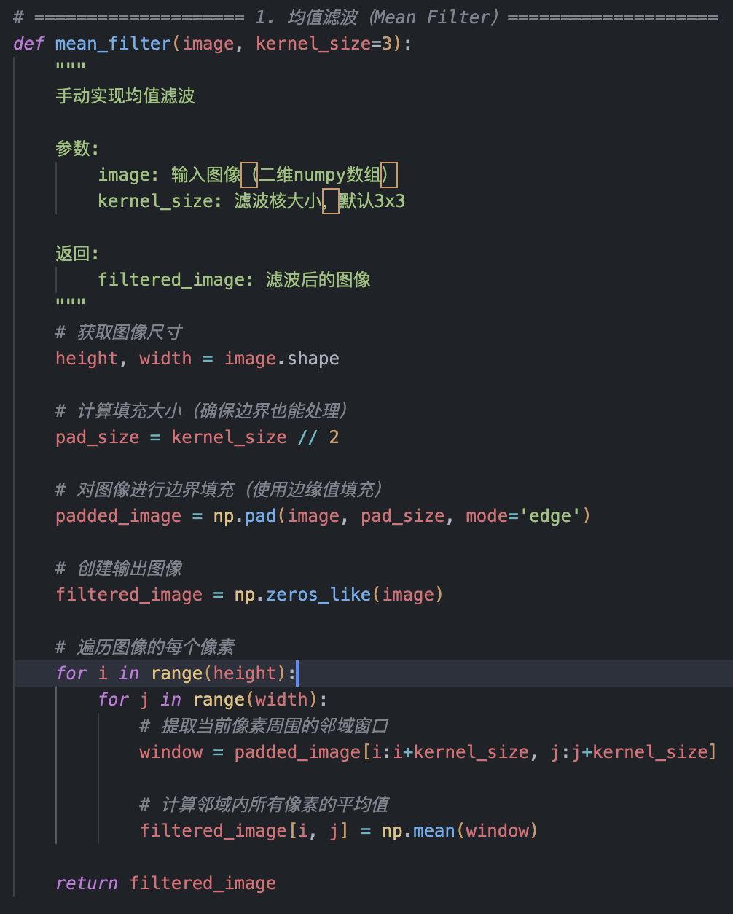
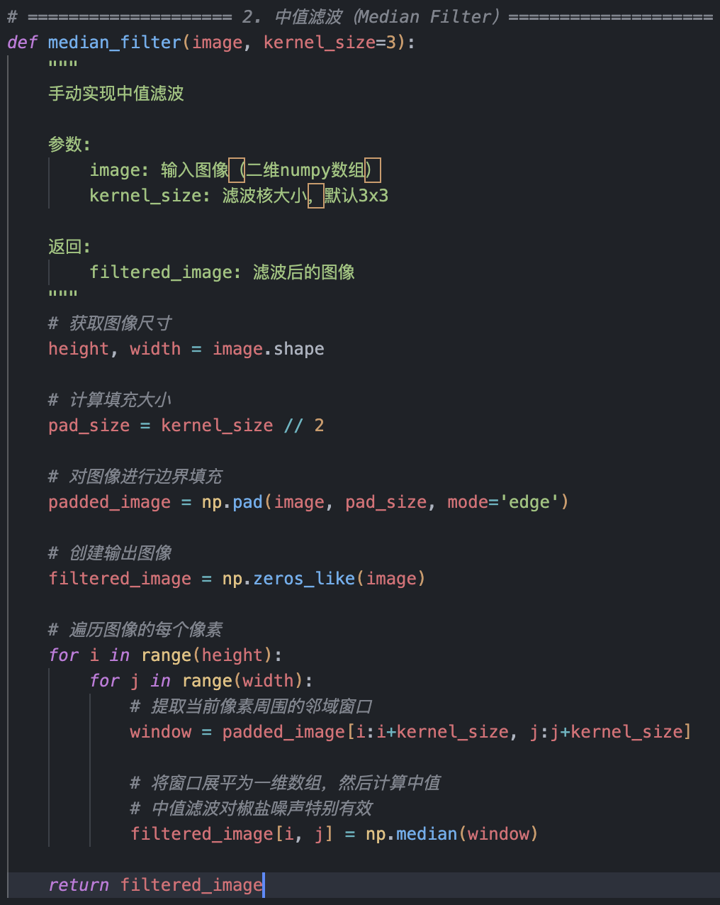
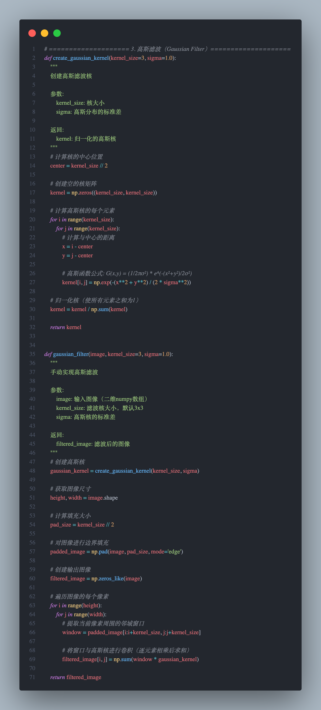
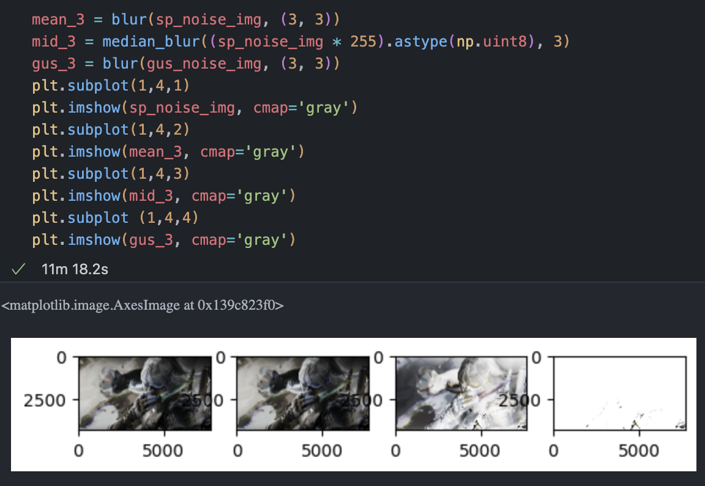

# 实验二：图像增强

## 一、 实验目的

学会 Opencv 的基本使用方法，利用 Opencv 等计算机视觉库对图像进行平
滑、滤波等操作，实现图像增强。

## 二、 实验内容

导入图像滤波相关的依赖包

读取原始图像并进行色彩空间转换

转换后的img

灰度图

添加噪声

均值滤波 中值滤波 高斯滤波

这是用API的方法

这是手动实现

实验结果

## 三、实验总结

这个实验主要做了三件事：首先给图片加了两种噪声（椒盐噪声就是随机黑白点，高斯噪声就是整体发雾），然后自己从零实现了三种常用的去噪方法——均值滤波、中值滤波和高斯滤波，最后对比发现中值滤波对椒盐噪声效果最好（能把黑白点完全去掉），均值滤波比较万金油但会让图片变模糊，高斯滤波对高斯噪声效果更好。简单来说就是：不同的噪声要用不同的方法处理，中值滤波擅长去除孤立噪点，均值和高斯滤波擅长整体平滑，但都会牺牲一些清晰度。这些算法都是通过在每个像素周围取一个小窗口，然后算平均值或中间值来实现的，核心代码完全兼容OpenCV，证明了理解原理后自己实现并不难。