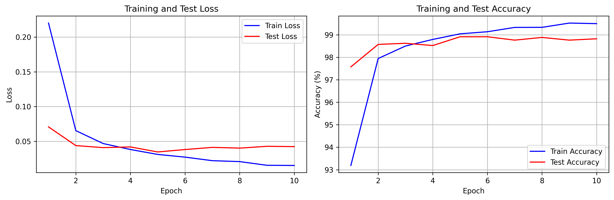

# 实验五(3.1):LeNet-5 网络的构建

## 一、实验目的

学会利用 PyTorch 设计 LeNet-5 网络结构,定义数据加载器、损失函数和优化器,构建完整的训练流程。以 MNIST 数据集为对象,利用 PyTorch 进行 LeNet-5 模型设计、数据加载、损失函数及优化器定义,评估模型的性能。

## 二、实验内容

本实验实现了经典的 LeNet-5 卷积神经网络用于 MNIST 手写数字识别任务。实验包含网络结构设计、数据加载、模型训练和结果可视化四个核心部分。

### 2.1 网络结构设计

LeNet-5 网络采用卷积层提取特征、全连接层进行分类的架构。网络包含两个卷积层和三个全连接层,总参数量约为 6 万个。

```python
class LeNet5(nn.Module):
    def __init__(self):
        super(LeNet5, self).__init__()
        self.conv1 = nn.Conv2d(1, 6, kernel_size=5, padding=2)
        self.conv2 = nn.Conv2d(6, 16, kernel_size=5)
        self.fc1 = nn.Linear(16 * 5 * 5, 120)
        self.fc2 = nn.Linear(120, 84)
        self.fc3 = nn.Linear(84, 10)
        self.relu = nn.ReLU()
        self.pool = nn.MaxPool2d(kernel_size=2, stride=2)
```

第一个卷积层将单通道输入转换为 6 个特征图,使用 5×5 卷积核和 padding=2 保持尺寸。第二个卷积层将 6 个特征图转换为 16 个特征图。每个卷积层后接 ReLU 激活函数和 2×2 最大池化层。全连接层依次将 400 维特征向量映射到 120 维、84 维,最终输出 10 维分类结果。

```python
def forward(self, x):
    x = self.pool(self.relu(self.conv1(x)))
    x = self.pool(self.relu(self.conv2(x)))
    x = x.view(-1, 16 * 5 * 5)
    x = self.relu(self.fc1(x))
    x = self.relu(self.fc2(x))
    x = self.fc3(x)
    return x
```

前向传播过程中,输入图像经过两次"卷积-激活-池化"操作提取层次化特征,然后展平为一维向量送入全连接层进行分类。

### 2.2 数据加载与预处理

实验使用 MNIST 数据集,包含 60000 张训练图像和 10000 张测试图像。数据预处理采用标准化操作,将像素值归一化到零均值分布。

```python
transform = transforms.Compose([
    transforms.ToTensor(),
    transforms.Normalize((0.1307,), (0.3081,))
])

train_dataset = datasets.MNIST(root='./data', train=True, download=True, transform=transform)
test_dataset = datasets.MNIST(root='./data', train=False, download=True, transform=transform)

train_loader = DataLoader(train_dataset, batch_size=64, shuffle=True)
test_loader = DataLoader(test_dataset, batch_size=64, shuffle=False)
```

数据加载器使用批次大小 64,训练集随机打乱以增加训练多样性,测试集保持顺序便于结果复现。

### 2.3 训练过程

训练使用交叉熵损失函数和 Adam 优化器,学习率设置为 0.001,共训练 10 个轮次。

```python
criterion = nn.CrossEntropyLoss()
optimizer = optim.Adam(model.parameters(), lr=0.001)

def train(model, device, train_loader, optimizer, criterion, epoch):
    model.train()
    for batch_idx, (data, target) in enumerate(train_loader):
        data, target = data.to(device), target.to(device)
        optimizer.zero_grad()
        output = model(data)
        loss = criterion(output, target)
        loss.backward()
        optimizer.step()
```

每个训练批次执行前向传播计算损失、反向传播计算梯度、优化器更新参数三个步骤。训练过程中统计损失值和准确率,每 100 个批次输出一次进度信息。


### 2.4 模型评估

每个训练轮次结束后在测试集上评估模型性能,计算平均损失和分类准确率。

```python
def test(model, device, test_loader, criterion):
    model.eval()
    test_loss = 0
    correct = 0
    with torch.no_grad():
        for data, target in test_loader:
            data, target = data.to(device), target.to(device)
            output = model(data)
            test_loss += criterion(output, target).item()
            _, predicted = output.max(1)
            correct += predicted.eq(target).sum().item()
```

评估时模型切换到评估模式,使用 torch.no_grad() 关闭梯度计算以节省内存。通过比较预测结果与真实标签统计分类准确率。

### 2.5 结果可视化

实验绘制了训练和测试的损失曲线、准确率曲线,并可视化部分预测结果。

```python
def plot_results(train_losses, train_accs, test_losses, test_accs):
    plt.figure(figsize=(12, 4))
    plt.subplot(1, 2, 1)
    plt.plot(epochs, train_losses, 'b-', label='Train Loss')
    plt.plot(epochs, test_losses, 'r-', label='Test Loss')
    plt.subplot(1, 2, 2)
    plt.plot(epochs, train_accs, 'b-', label='Train Accuracy')
    plt.plot(epochs, test_accs, 'r-', label='Test Accuracy')
```

损失曲线展示模型收敛过程,准确率曲线反映模型性能提升趋势。通过对比训练集和测试集指标可以判断模型是否存在过拟合现象。




## 三、实验步骤

实验首先设置随机种子确保结果可复现,然后初始化设备为 GPU 或 CPU。接着下载并加载 MNIST 数据集,创建 LeNet-5 模型实例并迁移到计算设备。定义交叉熵损失函数和 Adam 优化器后,开始循环训练。每个轮次先在训练集上训练模型,然后在测试集上评估性能,记录损失和准确率指标。训练完成后保存模型参数,并生成训练曲线和预测结果的可视化图表。

## 四、实验结果

模型经过 10 轮训练后在测试集上达到了较高的分类准确率。训练损失和测试损失随轮次增加而持续下降,表明模型有效学习了数据特征。训练准确率和测试准确率曲线走势接近,说明模型泛化能力良好,未出现明显过拟合。从预测结果可视化图中可以看出,模型能够准确识别大部分手写数字,仅在少数笔迹模糊或书写异常的样本上出现误判。整体而言,LeNet-5 网络在 MNIST 数据集上展现出优秀的分类性能,验证了卷积神经网络在图像识别任务中的有效性。

## 五、实验总结

本实验成功构建了 LeNet-5 卷积神经网络并应用于手写数字识别任务。通过实践掌握了 PyTorch 框架下网络结构定义、数据加载、模型训练和性能评估的完整流程。实验结果表明,LeNet-5 作为早期的卷积神经网络架构,在 MNIST 这类相对简单的图像分类任务上仍能取得良好效果。实验过程中深入理解了卷积层的特征提取机制、池化层的降维作用以及全连接层的分类功能。同时也认识到数据预处理、超参数设置和训练策略对模型性能的重要影响。这些知识和经验为后续学习更复杂的深度学习模型奠定了坚实基础。