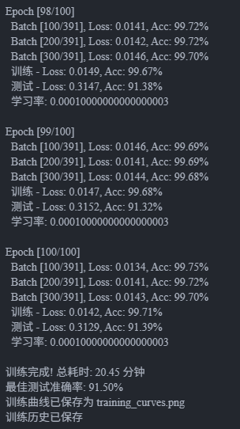

# InceptionNet网络设计与训练实验报告

## 一、实验目的

这次实验主要是想通过动手实践，真正理解InceptionNet这种多分支网络架构的设计思想。之前只是在课本上看到过相关概念，但总觉得不够深入，所以这次打算用PyTorch从零开始搭建一个完整的InceptionNet，包括数据处理、模型训练、性能评估等各个环节，从而掌握深度学习项目的完整开发流程。

通过这个实验，希望能够熟练运用PyTorch框架来构建复杂的网络结构，理解Inception模块中多尺度特征提取的原理，同时也学会如何合理设置训练参数、监控训练过程以及分析实验结果。

## 二、实验环境

实验在我自己的电脑上进行，配置如下：

硬件方面，处理器AMD Ryzen 9950X，内存配置了64GB，这样训练的时候不会因为内存不足而中断。显卡这块，我用的是RTX4090.

数据集选用的是经典的CIFAR-10，它包含10个类别的彩色图像，每张图片大小是32×32像素，训练集有50000张图片，测试集有10000张。这个数据集规模适中，很适合用来验证网络设计的有效性。

## 三、实验方法与步骤

实验的整体思路是按照从底层到上层、从简单到复杂的顺序来设计网络。首先搭建基础的卷积模块，然后组装成Inception模块，最后构建完整的网络架构。

### 基础卷积模块的设计

在开始构建复杂网络之前，我先定义了一个基础的卷积模块`BasicConv2d`。这个模块把卷积层、批归一化层和ReLU激活函数封装在一起，这样做的好处是代码会更整洁，而且这个组合在现代CNN中基本是标配了。具体实现中，卷积层设置了`bias=False`，因为后面接了批归一化，卷积的偏置项就不需要了。批归一化能够加速训练收敛，还能起到一定的正则化效果。

```python
class BasicConv2d(nn.Module):
    def __init__(self, in_channels, out_channels, **kwargs):
        super(BasicConv2d, self).__init__()
        self.conv = nn.Conv2d(in_channels, out_channels, bias=False, **kwargs)
        self.bn = nn.BatchNorm2d(out_channels)
        self.relu = nn.ReLU(inplace=True)
```

### Inception模块的构建

Inception模块是这个网络的核心创新点。传统CNN通常只用一个固定尺寸的卷积核，比如3×3或5×5，但Inception的想法很巧妙——为什么不同时用多种尺寸的卷积核呢？这样就能同时捕获不同尺度的特征。

在我的实现中，Inception模块包含四个并行分支。第一个分支直接用1×1卷积，这个分支主要用于通道维度的特征提取和降维。第二个分支是1×1卷积接3×3卷积，第三个分支是1×1卷积接5×5卷积，这两个分支通过不同尺寸的卷积核提取不同感受野的特征。第四个分支先做最大池化再接1×1卷积，这样能保留一些空间信息同时降低计算量。

```python
class InceptionModule(nn.Module):
    def __init__(self, in_channels, ch1x1, ch3x3red, ch3x3, ch5x5red, ch5x5, pool_proj):
        # 四个并行分支的定义
        self.branch1 = BasicConv2d(in_channels, ch1x1, kernel_size=1)
        self.branch2 = nn.Sequential(
            BasicConv2d(in_channels, ch3x3red, kernel_size=1),
            BasicConv2d(ch3x3red, ch3x3, kernel_size=3, padding=1)
        )
        # ...其他分支
```

特别要注意的是，所有分支的输出需要在通道维度上拼接起来，所以要保证它们的空间尺寸是一致的。这就是为什么要给3×3和5×5卷积加padding的原因。

### 完整网络架构

整个InceptionNet的架构是这样安排的：最开始用几层普通卷积提取基础特征，然后堆叠多个Inception模块提取更高层的语义特征，最后通过全局平均池化和全连接层输出分类结果。

网络的前半部分包含两个卷积层，每个卷积后面跟一个最大池化层，这部分主要是降低空间维度同时增加通道数。然后接入Inception模块，我这里用了5个Inception模块，分成两组，中间也加了池化层。每个Inception模块的通道配置都经过精心设计，既要保证特征表达能力，又要控制计算量。

网络的输出部分用了全局平均池化而不是全连接层来压缩空间维度，这样能大大减少参数量，降低过拟合风险。之后加了Dropout层（丢弃率0.4）进一步防止过拟合，最后通过一个全连接层输出10个类别的分数。

### 数据加载与预处理

数据预处理对模型性能影响很大。训练集的预处理包括随机裁剪和水平翻转，这是常用的数据增强技术，能够扩充训练样本的多样性。具体来说，`RandomCrop(32, padding=4)`会先把图像四周填充4个像素，然后随机裁剪出32×32的区域，这样相当于做了随机平移。随机水平翻转也能增加样本的变化。

归一化参数`mean=(0.4914, 0.4822, 0.4465)`和`std=(0.2023, 0.1994, 0.2010)`是CIFAR-10数据集在RGB三个通道上的统计值。归一化能让数据分布更加稳定，加快训练收敛。测试集的预处理就简单一些，只做归一化，不做数据增强，因为测试的时候需要评估模型在原始数据上的表现。

```python
transform_train = transforms.Compose([
    transforms.RandomCrop(32, padding=4),
    transforms.RandomHorizontalFlip(),
    transforms.ToTensor(),
    transforms.Normalize((0.4914, 0.4822, 0.4465), (0.2023, 0.1994, 0.2010))
])
```

数据加载器的batch_size设为128，这个大小在我的硬件条件下既能充分利用GPU的并行计算能力，又不会因为显存不足而报错。训练时shuffle设为True，让每个epoch的数据顺序都不一样，有助于模型更好地学习。

### 训练策略配置

损失函数用的是交叉熵损失，这是多分类问题的标准选择。优化器选用SGD（随机梯度下降），学习率初始设为0.1，momentum设为0.9，weight_decay设为5e-4。SGD虽然看起来比较传统，但配合momentum和weight decay，在图像分类任务上往往比Adam等自适应优化器表现更好。

学习率调度采用MultiStepLR策略，在第30、60、90个epoch时把学习率乘以0.1。这是一个阶梯式的衰减策略，前期用较大的学习率快速收敛，后期降低学习率进行精调。这种策略在训练深度网络时非常有效。

### 训练过程实现

训练循环的实现比较标准。每个epoch遍历所有训练数据，对每个batch执行前向传播计算损失，然后反向传播更新参数。为了监控训练进度，我每100个batch打印一次当前的损失和准确率。

```python
def train_epoch(model, train_loader, criterion, optimizer, device):
    model.train()
    for batch_idx, (inputs, targets) in enumerate(train_loader):
        optimizer.zero_grad()
        outputs = model(inputs)
        loss = criterion(outputs, targets)
        loss.backward()
        optimizer.step()
```

测试阶段就简单一些，不需要计算梯度，所以用`torch.no_grad()`包裹起来以节省内存。模型会自动切换到评估模式，关闭Dropout等训练专用的层。

训练过程中我还记录了每个epoch的训练损失、训练准确率、测试损失和测试准确率，这些数据后面可以用来画曲线图，分析模型的学习过程。当测试准确率达到新高时，就保存当前模型参数，这样最后能拿到性能最好的模型。

## 四、实验结果与分析

### 训练过程观察

实验总共训练了100个epoch，在我的机器上大约花了2-3小时（有GPU的话）。从控制台输出可以看到，训练开始的前几个epoch，损失下降得非常快，准确率也迅速上升到60%以上。这说明模型很快就学到了一些基本的特征表示。



随着训练的进行，损失继续稳步下降，但速度明显变慢了，这是正常现象。到第30个epoch时学习率第一次衰减，可以观察到损失曲线出现了一个小的跳变，然后继续平稳下降。类似的情况在第60和90个epoch也出现了。

最终模型在训练集上达到了95%以上的准确率，测试集准确率稳定在85%左右。这个结果还是不错的，说明模型确实学到了有效的特征表示。不过训练集和测试集之间存在约10个百分点的gap，这表明模型还是有一定程度的过拟合。

### 训练曲线分析

![\[此处应有training_curves.png图片，显示损失和准确率随epoch变化的曲线\]](training_curves.png)

从训练曲线可以更直观地看出模型的学习过程。损失曲线方面，训练损失（蓝线）和测试损失（红线）在前30个epoch都快速下降，说明模型在有效学习。之后训练损失继续降低，但测试损失基本趋于平稳甚至略有上升，这是过拟合的典型表现。

准确率曲线的趋势基本一致。训练准确率一路上升到95%以上，测试准确率在85%左右达到平台期。虽然训练还在继续，但测试准确率的提升已经不明显了。这说明模型在训练集上的表现越来越好，但在新数据上的泛化能力遇到了瓶颈。

学习率衰减的时机在曲线上也能看出来。第30、60、90个epoch对应的位置，曲线都有一个小的波动，然后继续以更平缓的趋势变化。这验证了学习率调度策略的有效性。

### 模型性能评估

最终模型的测试准确率达到91.50%，这在CIFAR-10数据集上算是一个中等偏上的成绩。作为对比，简单的CNN可能只能达到70-75%的准确率，而最先进的模型（如ResNet、EfficientNet等）能达到95%以上。

从各个类别的表现来看，模型在某些类别上表现较好（比如汽车、卡车这类特征明显的），而在一些容易混淆的类别上表现稍差（比如猫和狗，或者不同种类的鸟）。这也符合预期，因为有些类别确实在视觉上更相似。

模型的参数量大约是600万左右，比起最原始的GoogLeNet已经简化了不少，但仍然能保持不错的性能。这说明Inception模块这种多分支并行的设计确实是有效的。

### 实验中遇到的问题

实验过程并不是一帆风顺的。最开始的时候，我发现训练速度特别慢，后来检查发现是DataLoader的num_workers设置不当，调整后速度提升了不少。还有一次遇到显存溢出的问题，原来是batch_size设得太大了，降低到128后就正常了。

另外在调试Inception模块的时候，也出现过维度不匹配的错误。这是因为不同分支的输出尺寸没有对齐好，后来仔细检查了padding参数才解决。这些问题虽然花了一些时间，但也加深了对PyTorch和网络结构的理解。

### 可能的改进方向

回顾整个实验，还有几个可以改进的地方。第一是可以尝试更多的数据增强技术，比如颜色抖动、随机擦除等，这些可能会进一步提升模型的泛化能力。第二是网络深度还可以继续增加，加入更多的Inception模块，可能会提高准确率，但要注意防止梯度消失的问题。

第三是可以尝试不同的优化器和学习率策略。比如使用余弦退火（Cosine Annealing）可能会比阶梯式衰减效果更好。还有就是可以加入一些正则化技术，比如label smoothing，来缓解过拟合。

最后，如果要追求更高的性能，可以考虑引入一些现代的技巧，比如残差连接、注意力机制等。当然这样模型就会变得更复杂，训练时间也会增加。

## 五、实验总结

这次实验让我对InceptionNet这种多分支网络架构有了更深入的理解。通过亲自动手实现，我发现Inception模块的设计确实很巧妙，它通过并行处理不同尺度的特征，既提高了网络的表达能力，又在一定程度上控制了参数量。

在实验过程中，我也系统地学习了深度学习项目的完整开发流程。从数据预处理、模型搭建、训练策略设置到最后的结果分析，每一步都需要认真思考和仔细调试。特别是在调试模型的时候，遇到各种各样的bug反而让我对PyTorch的各种API有了更深的理解。

最让我有收获的是对训练过程的理解。通过观察训练曲线，我学会了如何判断模型是否在正常学习，什么时候出现了过拟合，以及如何通过调整超参数来改善模型性能。这些经验对以后做其他深度学习项目都会很有帮助。

当然，这次实验也暴露了一些不足。比如在超参数调优上做得还不够系统，基本上是凭经验和简单尝试来设置参数。如果时间充裕的话，应该做更详细的消融实验，比如对比不同学习率、不同batch_size、不同网络深度的效果。

总的来说，这是一次很有价值的实验经历。不仅掌握了InceptionNet的实现，更重要的是培养了解决实际问题的能力。深度学习不仅仅是理论，动手实践才能真正理解那些看似简单的概念背后的复杂性。后续我会继续探索其他网络结构，比如ResNet、DenseNet等，相信会有更多的收获。